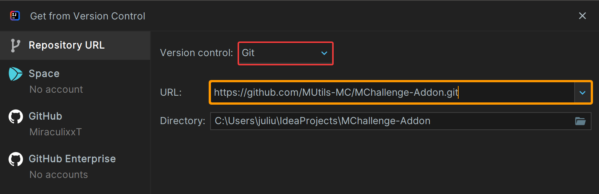
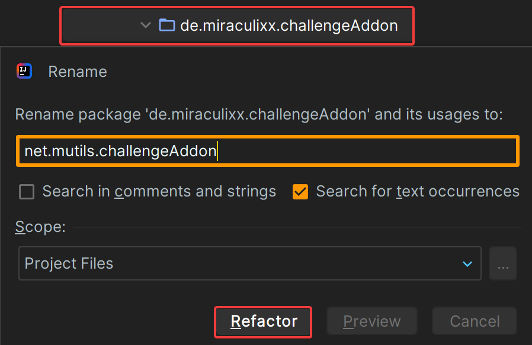
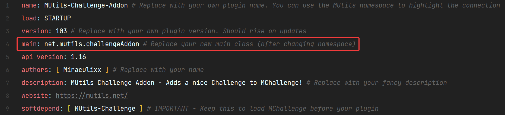

# MChallenge Addon Template
A template to create your own MChallenge addon. 
This addon is developed in Kotlin and as a PaperMC plugin.
You can create MChallenge addons for all platforms as long as MChallenge supports them too (Paper & Fabric).

More information - [MUtils Website](https://mutils.net)

---

## HOW TO
>If you already know how to clone and access Repositories, skip to step 3

### - Step 1
Create a new IntelliJ project and click on `Project from Version Control` and wait for Gradle to load the project.<br>
<details><summary>Images - Click to unfold</summary>

</details>

### - Step 2
If you plan to publish your addon, you should rename the ``de.miraculixx`` namespace to your own namespace. If you own a domain you can use this (e.g. ``mutils.net`` -> ``net.mutils``).
To rename a file or package press ``shift`` + `F6`, enter your new name and refactor.<br>
Additionally, you need to apply your changes in the `plugin.yml` file in the ``resources`` folder by changing the `main` attribute.
<details><summary>Images - Click to unfold</summary>
Rename a package or file<br>
<br>---<br>
Change the main attribute<br>
<br>

</details>

### - Step 3
Add a new mod enum in the ``utils/AddonMod`` enum class:
```kotlin
enum class AddonMod(val uuid: UUID) {
    MOD_ONE(UUID.randomUUID()),
    MOD_TWO(UUID.randomUUID()),
    ;
}
```
Additionally, each mod/challenge needs a default configuration (settings) and mod data (icon, name, ...). 
You can add a default configuration by extending the ``getDefaultSetting()`` function:
````kotlin
fun getDefaultSetting(): ChallengeData {
    return when (this) {
        MOD_ONE -> ChallengeData(emptyMap(), emptyMap()) // No settings
        MOD_TWO -> ChallengeData( // One integer setting with id 'damage'
                mapOf("damage" to ChallengeIntSetting("BEETROOT", 2, "hp", min = 1, max = 20)), // Setting data
                mapOf("damage" to IconNaming(cmp("Setting Name"), listOf(cmp("Setting Lore")))), // Setting display
            )
    }
}
````
You can add mod data by extending the ``getModData()`` function:
````kotlin
fun getModData(): CustomChallengeData {
    return when (this) {
        MOD_ONE -> CustomChallengeData(
            uuid,
            ModOneClass(),
            AddonManager.getSettings(this),
            Icon("CHEST", naming = IconNaming(cmp("Mod Name"), listOf(cmp("Mod Description")))),
            setOf(ChallengeTags.FUN)
        )
    }
}
````

### - Step 4
Finally, you have to add the core of your new mod, the logic! Create a new class inside the ``mods`` package (e.g. `ModOneClass`) and extend the `Challenge` interface from MChallenge API.
You must override at least the ``register()`` and `unregister()` functions. A detailed description can be viewed by hovering over all API classes and functions or entering them with `strg` + `left-click`.

A full example for a Mod that damage you on chest interactions:
````kotlin
class DamageOnChest : Challenge {
    private var damage: Int = 2

    override fun start(): Boolean {
        // Refresh all mod settings and apply them
        val settings = AddonManager.getSettings(AddonMod.DAMAGE_ON_CHEST_CLICK).settings
        damage = settings["damage"]?.toInt()?.getValue() ?: 2

        return true
    }

    override fun register() {
        // Register our listener
        onChestClick.register()
    }

    override fun unregister() {
        // Unregister our listener
        onChestClick.unregister()
    }

    /**
     * We use KSpigot to easily implement our listeners.
     * 
     * IMPORTANT
     * - Set the listen state "register" to false, to prevent preloading the listener!
     * - If you not use KSpigot for any reason, use a local state variable that toggles on and off in [register] and [unregister] and check the state at the start of your listener
     */
    private val onChestClick = listen<PlayerInteractEvent>(register = false) {
        val block = it.clickedBlock ?: return@listen
        if (block.type != Material.CHEST) return@listen
        it.player.damage(damage.toDouble())
    }
}
````
